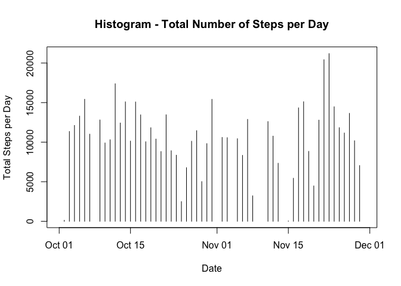

# Reproducible Research: Peer Assessment 1


## Loading and preprocessing the data

1. Load the data.  
2. Process/transform the data into a format suitable for analysis.  


```r
suppressPackageStartupMessages(library(dplyr))
data <- read.csv("activity.csv", stringsAsFactors=FALSE)
data$date <- as.Date(data$date)
summary(data)
```

```
##      steps             date               interval     
##  Min.   :  0.00   Min.   :2012-10-01   Min.   :   0.0  
##  1st Qu.:  0.00   1st Qu.:2012-10-16   1st Qu.: 588.8  
##  Median :  0.00   Median :2012-10-31   Median :1177.5  
##  Mean   : 37.38   Mean   :2012-10-31   Mean   :1177.5  
##  3rd Qu.: 12.00   3rd Qu.:2012-11-15   3rd Qu.:1766.2  
##  Max.   :806.00   Max.   :2012-11-30   Max.   :2355.0  
##  NA's   :2304
```


## What is mean total number of steps taken per day?

Ignore missing values in the dataset.  
1. Calculate the total number of steps taken per day.  
2. Make a histogram of the total number of steps taken each day.  
3. Calculate and report the mean and median of the total number of steps taken per day.  


```r
days <- group_by(data, date)
days <- summarise(days, nintervals=n(), avgsteps=mean(steps,na.rm=TRUE), totsteps=nintervals*avgsteps)
plot(days$date, days$totsteps, type="h",xlab="Date",ylab="Total Steps per Day",main="Histogram - Total Number of Steps per Day")
```

 

__Total Number of Steps Taken Each Day:__  

   Mean   |   Median  
--------- | -----------  
10766.19 | 10765  


## What is the average daily activity pattern?

1. Make a time series plot of the 5-minute interval and the average number of steps taken, averaged across all days.
2. Which 5-minute interval, on average across all the days in the dataset contains the maximum number of steps?

```r
intervals <- group_by(data, interval)
intervals <- summarise(intervals, avgsteps=mean(steps,na.rm=TRUE))
intervals <- mutate(intervals, minutes=as.integer(interval/100), seconds=(interval - 100*minutes), index=60*minutes + seconds)
plot(intervals$index/60, intervals$avgsteps, type="l", xlab="Interval (hours)", ylab="Average Steps", main="Daily Activity - Average Number of Steps", axes=FALSE)
axis(side=1, at=seq(0, 24, by=4))
axis(side=2, at=seq(0, 250, by=50))
```

 

```r
intervals <- filter(intervals, !is.na(avgsteps))
maxsteps <- summarise(intervals, maxsteps=max(avgsteps))
maxinterval <- filter(intervals, avgsteps == maxsteps$maxsteps)
```

__5-minute Interval Containing the Maximum Number of Steps__  

```
## Source: local data frame [1 x 5]
## 
##   interval avgsteps minutes seconds index
## 1      835 206.1698       8      35   515
```


## Imputing missing values

1. Calculate and report the total number of missing values in the dataset.  
2. Devise a strategy for filling in all of the missing values in the dataset.  
3. Create a new dataset with the missing data filled in.  
4. Make a histogram of the total number of steps taken each day.  Calculate and report the __mean__ and the __median__ total number of steps taken each day.  

__Total Number of NA's:__ 2304

```r
summary(data)
```

```
##      steps             date               interval     
##  Min.   :  0.00   Min.   :2012-10-01   Min.   :   0.0  
##  1st Qu.:  0.00   1st Qu.:2012-10-16   1st Qu.: 588.8  
##  Median :  0.00   Median :2012-10-31   Median :1177.5  
##  Mean   : 37.38   Mean   :2012-10-31   Mean   :1177.5  
##  3rd Qu.: 12.00   3rd Qu.:2012-11-15   3rd Qu.:1766.2  
##  Max.   :806.00   Max.   :2012-11-30   Max.   :2355.0  
##  NA's   :2304
```


## Are there differences in activity patterns between weekdays and weekends?

1. Create a new _factor_ variable in the dataset, with two levels - "weekday" and "weekend," indicating whether a given date is a weekday or weekend day.  
2. Make a panel plot containing a time series plot of the 5-minute interval and the average number of steps taken, averaged across all weekday days or weekend days.  

